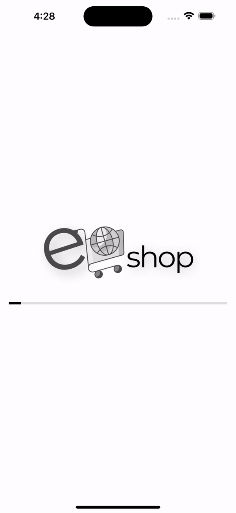
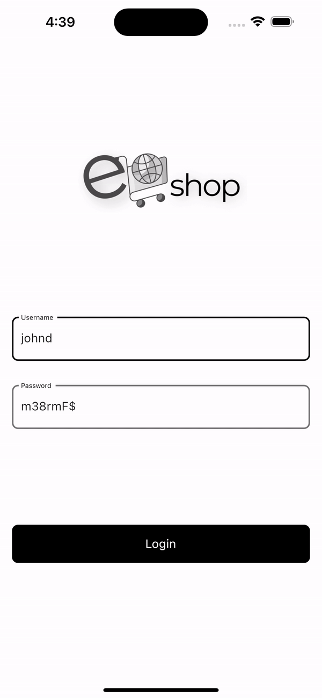
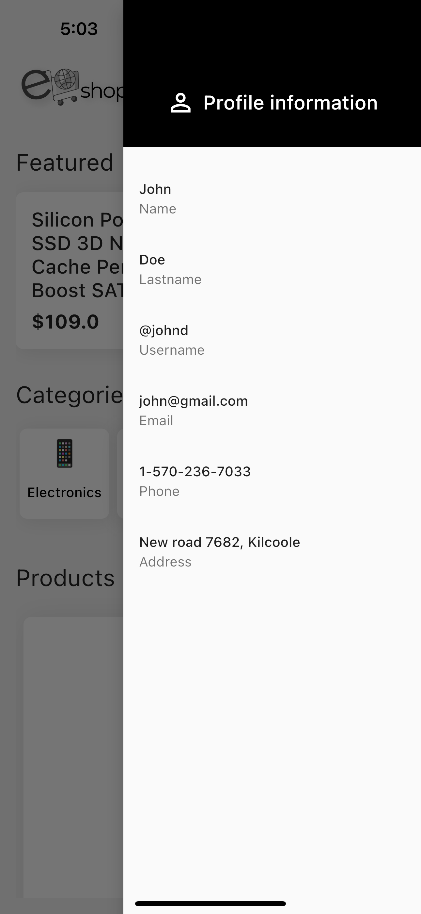
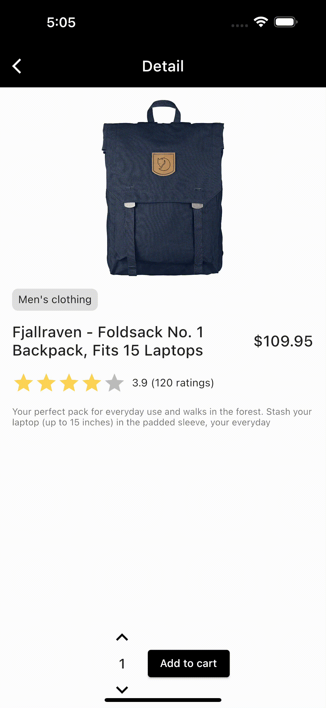
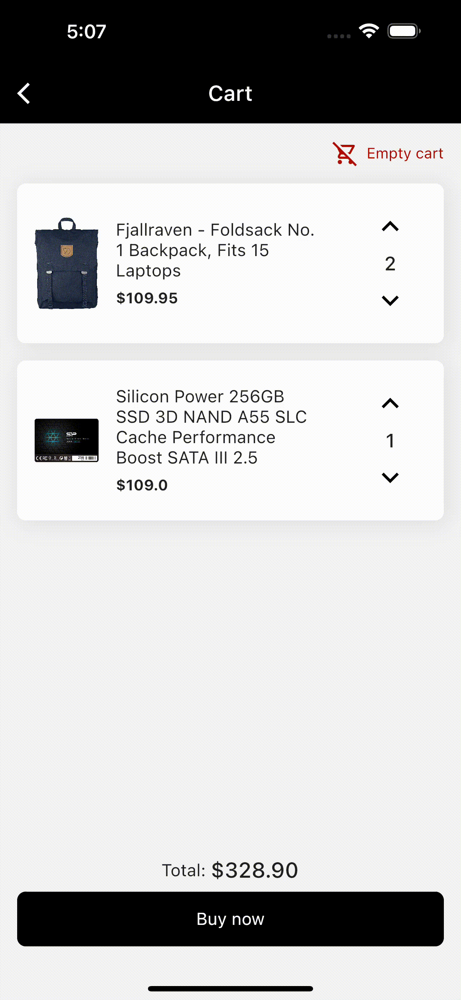

# Eshop: A Flutter E-Commerce App

An online shopping app connected to a public API.


## Overview

This Flutter app is an e-commerce application that enables users to browse and shop for products from the [FakeStore API](https://fakestoreapi.com/). The app features a user authentication system, product listings, a shopping cart, and various UI elements to enhance the user experience.

## Installation

1. Clone the repository:

   ```bash
   git clone https://github.com/belenyb/eshop.git

2. Navigate to the project directory:
   ```bash
    cd eshop

3. Install dependencies:
   ```bash
    flutter pub get

4. Run the app:
   ```bash
    flutter run


## Features

### Splash Screen
The splash screen uses a Stateful Widget and AnimatedBuilder to create a loading effect.



### Login
User authentication is implemented via the FakeStore API login service. Form validation is included.

###### Test credentials:
```
username: "johnd"
password: "m38rmF$"
```


### Home
The home screen starts with a featured product randomly selected using the `getFeaturedProduct()` function inside the `app_provider.dart` file. This function utilizes a random number generator from the [dart:math ](https://api.dart.dev/stable/3.2.3/dart-math/dart-math-library.html) library. Featured products use hero animation for a smooth transition between screens. The main page also contains a categories filter and a short list of products that can be expanded by clicking on the `SEE ALL` button.


### Profile drawer
By clicking on the profile icon in the app bar, users can access the profile drawer. This information is also obtained from the public API.



### Product detail
The screen includes additional product information and provides an "Add to Cart" functionality. When the user adds an item to the cart, a `View Cart` button is provided as a shortcut. This screen also includes rating stars using the [flutter_rating_bar](https://pub.dev/packages/flutter_rating_bar) package.



### Cart
Add, remove, update, or empty all items using the [provider](https://pub.dev/packages/provider) package. The shopping cart employs the dismissible effect for easy item removal.


